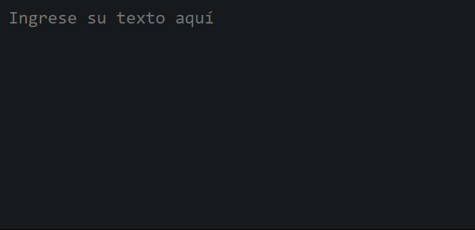
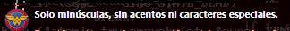
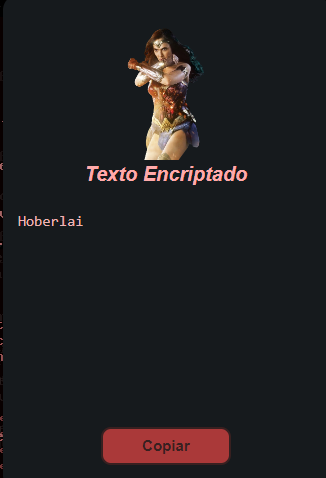
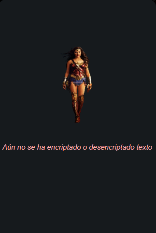
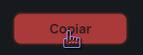
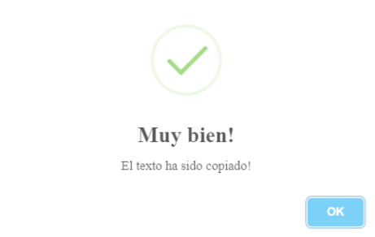

# Wonder Encryptor

_Este proyecto ha sido creado por Alura Latam dentro el curso Lógica de programación con JavaScript del Programa ONE Oracle Next Education, para el Challenge #1 propuesto. El reto consiste en diseñar un encriptador de texto partiendo del diseño inicial de Alura Latam, teniendo en cuenta los requisitos exigidos y algunos extras en el desarrollo, con lo cual estamos demostrando nuestro avance en el aprendizaje dentro del programa._

_De ante mano muchas gracias a Alura Latam y a Oracle por la gran oportunidad de estar dentro de tan excelente programa._

## 🔧 Proyecto desarrollado con

## Funcionalidades 

* _La página tiene un campo `<Ingrese su texto aquí>` para la digitación del texto que será encriptado o desencriptado._

* _El campo `<Ingrese su texto aquí>` valida si el usuario ingresa desde su teclado letras en mayúsculas, caracteres especiales, números o acentos, para mostrar una alerta indicando que no están permitidos. Como indica bajo el mismo._

* _El resultado se muestra en la pantalla en la sección derecha._

* _El cual se ve de la siguiente manera antes de ser encriptado el texto._

* _Existe un botón "Copiar", en la sección derecha, que permite copiar al clipboard el texto encriptado/desencriptado, de modo que si pegamos (Ctrl+V) dicho texto en el campo principal, podemos devolver una palabra encriptada para su versión original y viceversa._

* _Finalmente el usuario verá la confirmación de su texto copiado exitosamente._

## Agradecimientos

_De ante mano muchas gracias a Alura Latam y a Oracle por la gran oportunidad de estar dentro de tan excelente programa._

## Diseñado

_con ❤️ por @eandreaja_